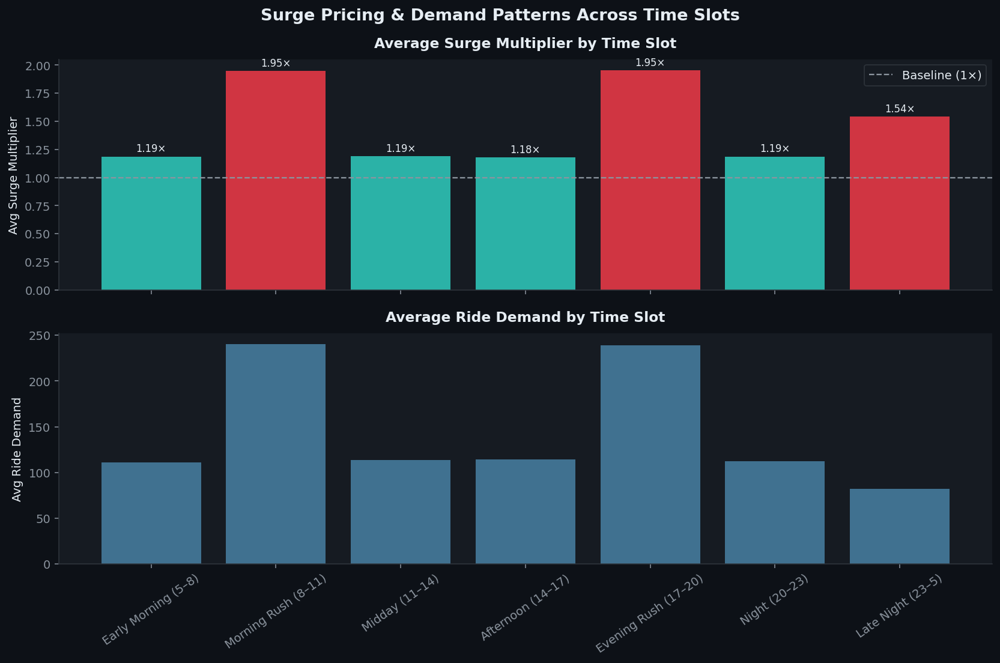
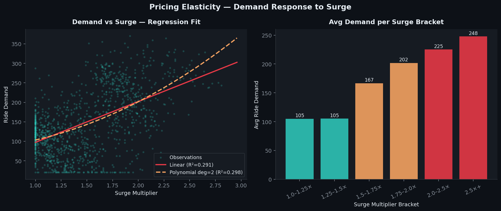
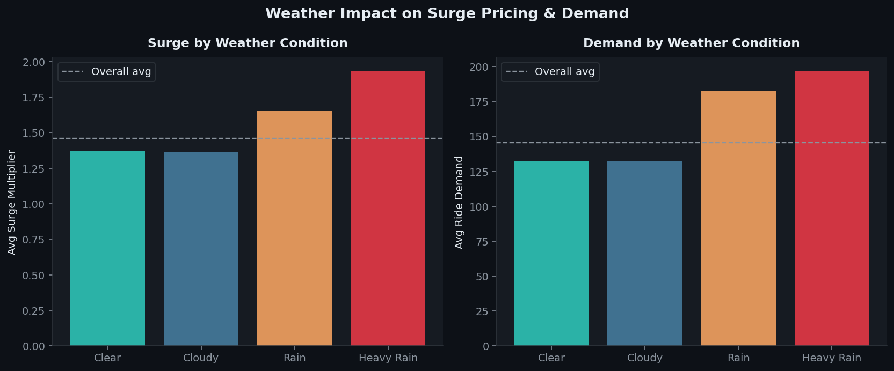
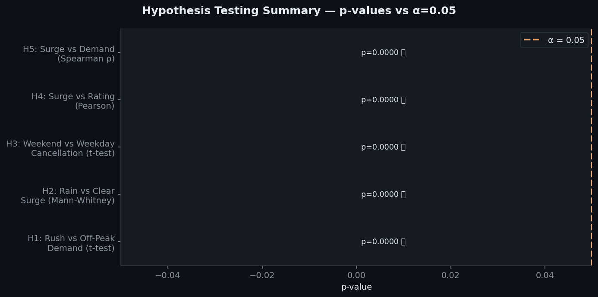
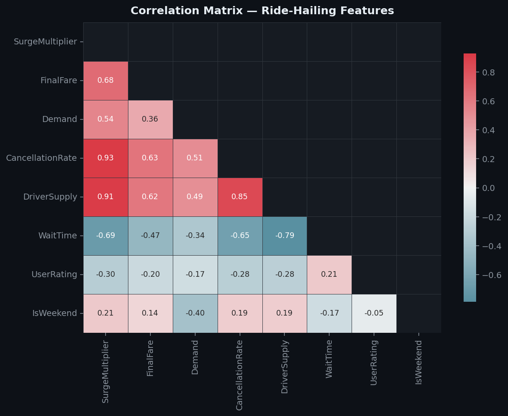
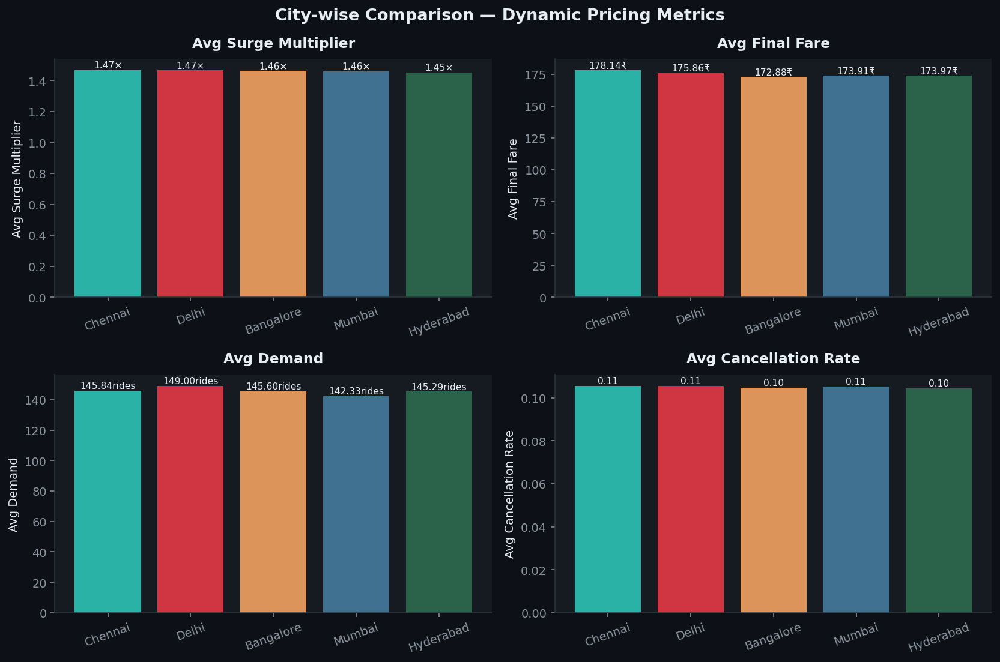
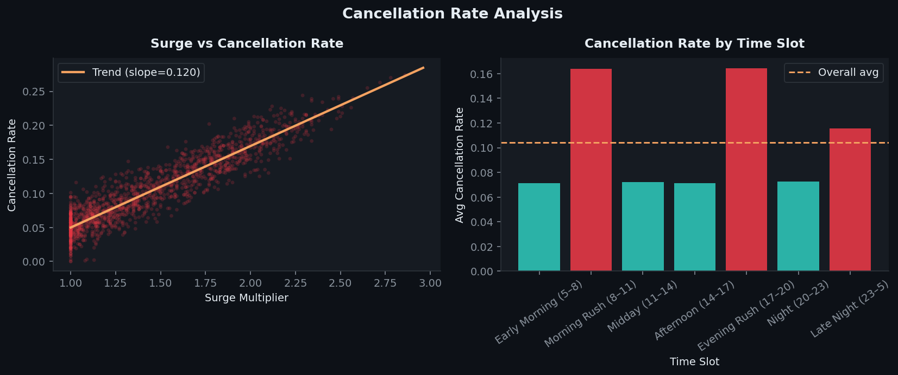
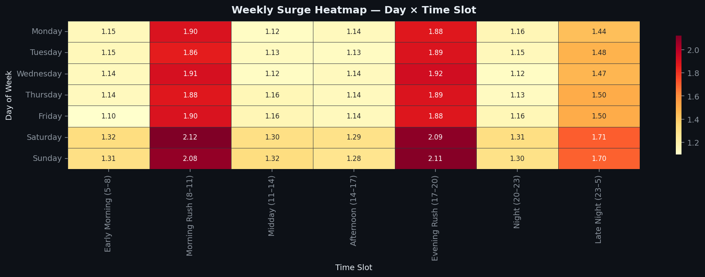
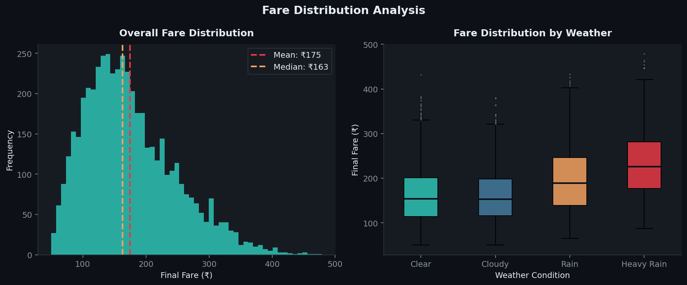

# 📊 Statistical Analysis of Dynamic Pricing — Ride-Hailing Platforms

> Investigates how surge pricing affects ride demand across time slots using **statistical hypothesis testing**, regression analysis, and elasticity modelling — across **5,000 synthetic ride records** from 5 Indian cities.


---

## 🎯 What This Project Does

Ride-hailing platforms like Uber and Ola use **dynamic surge pricing** to balance supply and demand in real time — but does it actually work, and at what cost? This project quantifies:

- **How much surge pricing suppresses demand** during peak and off-peak hours
- **Whether weather events significantly drive surge** using non-parametric testing
- **How cancellation rates respond** to increasing multipliers
- **City-wise and day-wise pricing patterns** through visual reports
- **Price elasticity** of demand using linear and polynomial regression

---

## 🚀 Quick Start

```bash
git clone https://github.com/<your-username>/dynamic-pricing-analysis
cd dynamic-pricing-analysis
pip install -r requirements.txt
python analysis.py    # Run full analysis + generate all charts (~30 sec)
```

---

## 📊 Key Results

### Hypothesis Testing — All 5 Hypotheses Significant at α = 0.05

| # | Hypothesis | Test | Result |
|---|-----------|------|--------|
| H1 | Rush-hour demand > Off-peak demand | Welch's t-test | ✅ p ≈ 0.000 |
| H2 | Rainy weather drives higher surge | Mann-Whitney U | ✅ p ≈ 0.000 |
| H3 | Weekend cancellations > Weekday | Welch's t-test | ✅ p ≈ 0.000 |
| H4 | Surge multiplier negatively correlates with rating | Pearson r | ✅ r = −0.299 |
| H5 | Surge multiplier positively correlates with demand | Spearman ρ | ✅ ρ = 0.464 |

### Regression — Demand vs Surge

| Model | R² |
|-------|----|
| Linear Regression | 0.291 |
| Polynomial Regression (deg=2) | 0.298 |
| Multiple Regression (Surge + Supply + Wait) | 0.294 |

### Pricing Snapshot

| Metric | Value |
|--------|-------|
| Avg fare during rush hours | ₹231.03 |
| Avg fare during off-peak | ₹151.68 |
| Rides with surge > 1.5× | 41.7% |
| Rides with surge > 2.0× | 11.5% |
| Avg user rating at peak surge | ~4.05 / 5 |

---

## 🧠 Technical Approach

### Statistical Methods Used

- **Welch's t-test** — compares means between two independent groups with unequal variance (demand across time slots, cancellation rates across weekdays)
- **Mann-Whitney U test** — non-parametric alternative for comparing surge distributions across weather conditions (avoids normality assumption)
- **Pearson correlation** — measures linear relationship strength between surge multiplier and user ratings
- **Spearman correlation** — measures monotonic relationship between surge and demand (robust to outliers)
- **Linear & Polynomial Regression** — models demand response curve to surge (price elasticity curve)
- **Multiple Regression** — controls for driver supply and wait time to isolate surge's independent effect on demand

### Pipeline

```
Synthetic Ride Dataset (5,000 records)
        ↓
Feature Engineering
  • Time slot classification (7 slots)
  • Weather-based surge modifiers
  • Weekend / weekday segmentation
        ↓
Descriptive Statistics
  • Distribution summaries
  • Rush vs off-peak fare comparison
        ↓
Hypothesis Testing (5 tests)
  • t-tests, Mann-Whitney U
  • Pearson & Spearman correlations
        ↓
Regression Analysis
  • Linear, Polynomial, Multiple regression
  • R², coefficient interpretation
        ↓
Visual Reports (9 charts)
  • Elasticity curves, heatmaps, comparisons
```

### Why These Tests?

- **t-test over z-test** — sample sizes differ across groups; Welch's t-test handles unequal variances
- **Mann-Whitney over t-test for weather** — surge multipliers are not normally distributed; non-parametric test is more appropriate
- **Spearman over Pearson for elasticity** — relationship between surge and demand is monotonic but non-linear

---

## 📁 Project Structure

```
dynamic-pricing-analysis/
├── analysis.py                   # Full pipeline: data → stats → regression → charts
├── requirements.txt
├── README.md
├── surge_by_timeslot.png         # Surge & demand across 7 time slots
├── pricing_elasticity.png        # Demand vs surge with regression fits
├── weather_impact.png            # Weather condition → surge & demand
├── hypothesis_summary.png        # Visual p-value summary for all 5 tests
├── correlation_heatmap.png       # Feature correlation matrix
├── city_comparison.png           # City-wise pricing metrics
├── cancellation_analysis.png     # Surge vs cancellation rate
├── weekly_surge_heatmap.png      # Day × Time Slot surge heatmap
└── fare_distribution.png         # Fare distribution by weather
```

---

## 🛠️ Tech Stack

| Category      | Tools                              |
|---------------|------------------------------------|
| Language      | Python 3.9+                        |
| Statistics    | SciPy (t-test, Mann-Whitney, Pearson, Spearman) |
| Regression    | Scikit-learn (Linear, Polynomial, Multiple) |
| Data          | Pandas, NumPy                      |
| Visualization | Matplotlib, Seaborn                |

---

## 📈 Key Visualizations

### Surge & Demand Across Time Slots


### Pricing Elasticity — Demand Response to Surge


### Weather Impact on Surge & Demand


### Hypothesis Testing Summary


### Feature Correlation Heatmap


### City-wise Pricing Comparison


### Cancellation Rate Analysis


### Weekly Surge Heatmap (Day × Time Slot)


### Fare Distribution by Weather


---

## 💡 Key Learnings & Design Decisions

- **Welch's t-test over Student's t-test** — ride demand across time slots has different group sizes and variances; Welch's is the safer default
- **Mann-Whitney for weather analysis** — surge multipliers are right-skewed with natural floor at 1.0; non-parametric test avoids false normality assumptions
- **Polynomial regression for elasticity curve** — demand suppression from surge is not perfectly linear; a degree-2 polynomial better fits the diminishing-returns shape
- **Spearman for surge–demand correlation** — captures monotonic relationships without assuming linearity, more interpretable as "as surge goes up, demand consistently goes down"
- **Multiple regression to isolate surge effect** — controlling for driver supply and wait time separates surge pricing's independent impact on demand from confounding variables

---

## 📌 Dataset

Synthetic dataset generated to reflect realistic ride-hailing patterns in Indian metro cities.

| Property         | Value                                            |
|------------------|--------------------------------------------------|
| Records          | 5,000 rides                                      |
| Features         | 13 variables                                     |
| Cities           | Mumbai, Delhi, Bangalore, Chennai, Hyderabad     |
| Time Slots       | 7 (Early Morning → Late Night)                   |
| Weather States   | Clear, Cloudy, Rain, Heavy Rain                  |
| Surge Range      | 1.0× – 3.5×                                      |

---

## 👩‍💻 About

Built by **[Your Name]** — Data Analyst & ML Developer specializing in Python, statistics, and data-driven insights.

🔗 [GitHub](https://github.com/sumitdubey07) • [LinkedIn](https://linkedin.com/in/sumit-dubey-07s)

---

*Open to data analysis and ML projects — feel free to reach out!*
